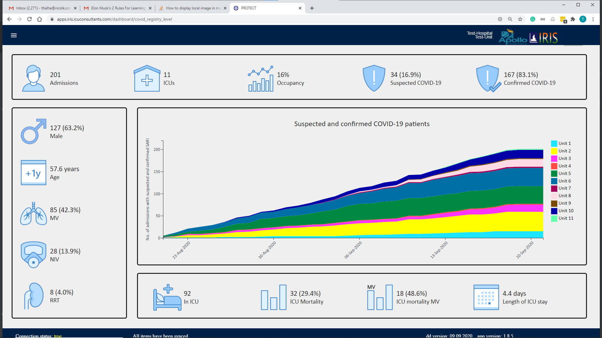

## Output  
### covid cases  
**Functions:**  
No function required  

**Data required:**  
1. Admission dataset
    1. admission.sari
    2. sariPreDischarge.sari_diagnosis
    3. sariPreDischarge.sari1

**Description:**  
Use admissionn.sari as base for covidStatus column. If sariPreDischarge.sari_diagnosis or sariPreDischarge.sari1 is not nan then use this value instead. Now we have the covid Status column filter by suspected or confirmed.  

### covid in patients
**Functions:**  
No function required  

**Data required:**  
1. Admission dataset
    1. dischargeStatus

**Description:**  
After you filtered the data for covid patients only. count patients with dischargeStatus == 'false'

### Bed occupancy  
**Functions:**  
1. bed_occupancy_custom_range(admission_this_month, los, beds, date)  
2. length_of_stay(data, admission_type=None)  
3. number_of_beds(data, testUnits, date, unit_list = False)  
  
**Data required:**  
1. Admission dataset
    1. admission.date_of_admission  
    2. discharge.date_of_discharge  
    
2. Unit information  
  
3. Date range (user input)

**Description:**  
(Number of admission * Length of stay) / (beds * number of days)
  
  
### suspected covid 
**Functions:**  
n_per_join(n, per)

**Data required:**  
1. Admission dataset
    1. admission.sari
    2. sariPreDischarge.sari_diagnosis
    3. sariPreDischarge.sari1

**Description:**  
After you filtered the data for covid patients only. count patients with covidStatus == 'suspected'

### confirmed covid label
**Functions:**  
n_per_join(n, per)

**Data required:**  
1. Admission dataset
    1. admission.sari
    2. sariPreDischarge.sari_diagnosis
    3. sariPreDischarge.sari1

**Description:**  
After you filtered the data for covid patients only. count patients with covidStatus == 'confirmed'

### male label
**Functions:**  
n_per_join(n, per)

**Data required:**  
1. Admission dataset
    1. admission.sari
    2. sariPreDischarge.sari_diagnosis
    3. sariPreDischarge.sari1
    4. admission.gender

**Description:**  
After you filtered the data for covid patients only. count patients with admission.gender == 'Male'

### mean age
**Functions:**  
n_per_join(n, per)

**Data required:**  
1. Admission dataset
    1. admission.sari
    2. sariPreDischarge.sari_diagnosis
    3. sariPreDischarge.sari1
    4. admission.age

**Description:**  
After you filtered the data for covid patients only. Make sure admission.age is numeric round mean to (1dp).

### mec vent label
**Functions:**  
n_per_join(n, per)

**Data required:**  
1. Admission dataset
    1. admission.sari
    2. sariPreDischarge.sari_diagnosis
    3. sariPreDischarge.sari1
    4. sariAdmissionAssessment.mechanically_ventilated
    5. admissionAssessment.mechanically_ventilated

**Description:**  
After you filtered the data for covid patients only. Join admissionAssessment.mechanically_ventilated and sariAdmissionAssessment.mechanically_ventilated so we can calcuatle the value for ward units. then get number and per of mechanically_ventilated == 'mechanical_vent'

### non invasive label
**Functions:**  
n_per_join(n, per)

**Data required:**  
1. Admission dataset
    1. admission.sari
    2. sariPreDischarge.sari_diagnosis
    3. sariPreDischarge.sari1
    4. sariAdmissionAssessment.mechanically_ventilated_source
    5. admissionAssessment.mechanically_ventilated_source

**Description:**  
After you filtered the data for covid patients only. Join admissionAssessment.mechanically_ventilated_source and sariAdmissionAssessment.mechanically_ventilated_source so we can calcuatle the value for ward units. then get number and per of mechanically_ventilated_source
mechanically_ventilated_source == 'Non invasive vent'

### rrt label
**Functions:**  
n_per_join(n, per)

**Data required:**  
1. Admission dataset
    1. admission.sari
    2. sariPreDischarge.sari_diagnosis
    3. sariPreDischarge.sari1
    4. sariAdmissionAssessment.renal_replacement
    5. admissionAssessment.renal_replacement

**Description:**  
After you filtered the data for covid patients only. Join admissionAssessment.renal_replacement and sariAdmissionAssessment.renal_replacement so we can calcuatle the value for ward units. then get number and per of renal_replacement == 'Yes'

### covid count by day
**Functions:**  
covid_count_for_unit(covid_data, start_date, end_date):

**Data required:**  
1. Admission dataset
    1. admission.sari
    2. sariPreDischarge.sari_diagnosis
    3. sariPreDischarge.sari1
    4. admission.date_of_admission / admission.date_of_admission_hospital

**Description:**  
After you filtered the data for covid patients only. Reindex data to include a row for each date in range. groupby date and cumilatively count the admissions.

**Output**
list of dicts 

### covid discharge count
covid count - covid in patients

### dead label
**Functions:**  
n_per_join(n, per)

**Data required:**  
1. Admission dataset
    1. admission.sari
    2. sariPreDischarge.sari_diagnosis
    3. sariPreDischarge.sari1
    4. discharge.discharge_status

**Description:**  
After you filtered the data for covid patients only. Get number and per of discharge.discharge_status == 'Dead'

### mec vent dead label
**Functions:**  
n_per_join(n, per)

**Data required:**  
1. Admission dataset
    1. admission.sari
    2. sariPreDischarge.sari_diagnosis
    3. sariPreDischarge.sari1
    4. discharge.discharge_status
    5. sariAdmissionAssessment.mechanically_ventilated_source
    6. admissionAssessment.mechanically_ventilated_source

**Description:**  
After you filtered the data for covid patients only. Filter by invasive ventilaiton. Then get number and per of discharge.discharge_status == 'Dead'

  
### Length of stay (admission type)  
**Functions:**  
1. length_of_stay(data, admission_type=None) 

**Data required:**  
1. Admission dataset
    1. admission.date_of_admission
    2. discharge.date_of_discharge

**Description:**  
Date of admission - Date of discharge = X Days

### unit type
If admission.date_of_admission is in the admission dataset then it is a icu unit other wise it is a ward.

### unit type cap
unit type.upper()

## Data required

### Admission dataset
1. patient_id
2. admission.sari
3. sariPreDischarge.sari_diagnosis
4. sariPreDischarge.sari1
5. admission.age
6. admission.gender
7. sariAdmissionAssessment.mechanically_ventilated_source
8. admissionAssessment.mechanically_ventilated_source
9. sariAdmissionAssessment.renal_replacement
10. admissionAssessment.renal_replacement
11. sariAdmissionAssessment.mechanically_ventilated
12. admissionAssessment.mechanically_ventilated
13. admission.date_of_admission / admission.date_of_admission_hospital
14. discharge.date_of_discharge
15. discharge.discharge_status
    
    
### Unit info
