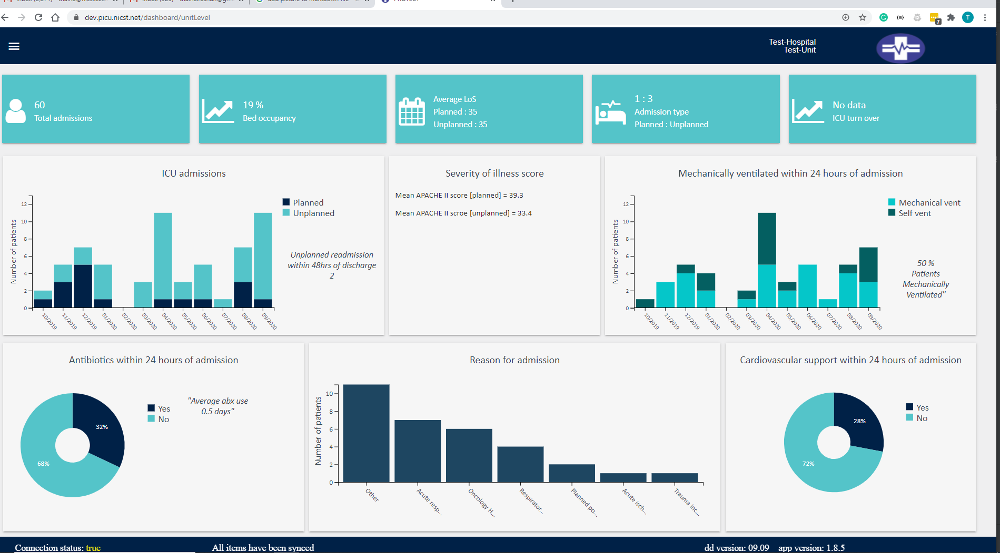

## Output
### Total admission
**Functions:**  
No function required  

**Data required:**  
1. Admission dataset

**Description:**  
Number of records in admission dataset.  
  
    
### Bed occupancy  
**Functions:**  
1. bed_occupancy_custom_range(admission_this_month, los, beds, date)  
2. length_of_stay(data, admission_type=None)  
3. number_of_beds(data, testUnits, date, unit_list = False)  
  
**Data required:**  
1. Admission dataset
    1. admission.date_of_admission  
    2. discharge.date_of_discharge  
    
2. Unit information  
  
3. Date range (user input)

**Description:**  
(Number of admission * Length of stay) / (beds * number of days)
  
  
### Length of stay (admission type)  
**Functions:**  
1. length_of_stay(data, admission_type=None) 

**Data required:**  
1. Admission dataset
    1. admission.date_of_admission
    2. discharge.date_of_discharge

**Description:**  
Date of admission - Date of discharge = X Days
  
  
### Admission type (ratio)  
**Functions:**  
1. admission_type_ratio(data)

**Data required:**  
1. Admission dataset
    1. admission.admission_type

**Description:**    
number of unplanned admissions / number of planned admission  
  
  
### ICU turn over  
**Functions:**  
1. icuTurnOver(numberOfAdmission, numberOfBeds)
2. number_of_beds(data, testUnits, date, unit_list = False)  

**Data required:**  
1. Admission dataset
2. unit info

**Description:**    
Number of admission / number of beds
  
    
### Admission type (by month)  
**Functions:**  
admission_type_by_month(data, start_date=None, end_date=None):

**Data required:**  
1. Admission dataset
    1. admission.date_of_admission
    2. admission.admission_type
    
**Description:**
Number of admission by month and admission type

**Output**  
list of dicts.    
  
  
### Apache II score (admission type)  
**Functions:**  
apache_score(data)

**Data required:**    
1. Admission dataset
    1. admission.admission_type  
    2. admissionAssessment.apache_score  
    
**Description:**  
Mean and sd for apache score grouped by admission type.  

**Output**    
Dict  
  
  
### Ventilation (by month)  
**Functions:**  
mec_vent_by_month(data, start_date=None, end_date=None):

**Data required:**    
1. Admission dataset
    1. admission.date_of_admission
    2. admissionAssessment.mechanically_ventilated
    
**Description:**  
Number of admission by month and ventilation type

**Output**    
list of dicts.  
  
  
### Antibiotics (percentage list)  
**Functions:**  
use_of_antibiotics(data, admission_this_month):

**Data required:**    
1. Admission dataset
    1. admissionAssessment.antibiotics
    
**Description:**  
Percent and count of patients on antibiotics on admission.

**Output**    
Dict. The yes and no percentage is then put in a list to match the nesersary format.
  
  
### Antibiotics use (days)
**Functions:**  
time_on_antibiotics(data_on_admission, daily_assessment_data):

**Data required:**    
1. Admission dataset
    1. patient_id
    2. admissionAssessment.antibiotics

2. Daily assessment
    1. patient_id
    2. antibiotics
    
**Description:**  
Mean number of recorded days on antiotics on admission or in the daily form

**Output**    
Int
  
    
### Reason for admission  
**Functions:**  
top_ten_diagnosis_on_admission(data, exclusion_list=['']):

**Data required:**    
1. Admission dataset
    1. admission.system 
    2. admission.apache_diagnosis
    3. admission.diagnosis_type
    
2. systeam_diagnosis_joined.csv
    
**Description:**  
Find the top ten diagnosis by joining ssystem apahce diagnosis and diagnosis type and couning each combination.

**Output**    
List of dicts 
  
  
### Cardiovascular support (percentage list)  
**Functions:**  
cardiovascular_support_stats(data, admission_type=None):

**Data required:**    
1. Admission dataset
    1. admissionAssessment.cardiovascular_support
    
**Description:**  
Get count and per of patients with cardiovasular support.

**Output**    
Dict. The yes and no percentage is then put in a list to match the nesersary format.
  
  

## Data required

### Admission dataset
1. patient_id
2. admission.date_of_admission
3. admission.admission_type
4. admission.system 
5. admission.apache_diagnosis
6. admission.diagnosis_type
7. admissionAssessment.cardiovascular_support
8. admissionAssessment.antibiotics
9. admissionAssessment.mechanically_ventilated
10. admissionAssessment.apache_score  
11. discharge.date_of_discharge  
    
    
### Daily assessment
1. patient_id
2. antibiotics    
    
### Unit info

### systeam_diagnosis_joined.csv
